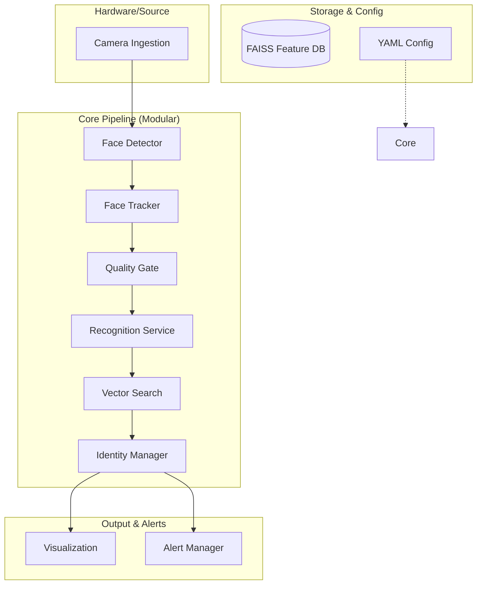
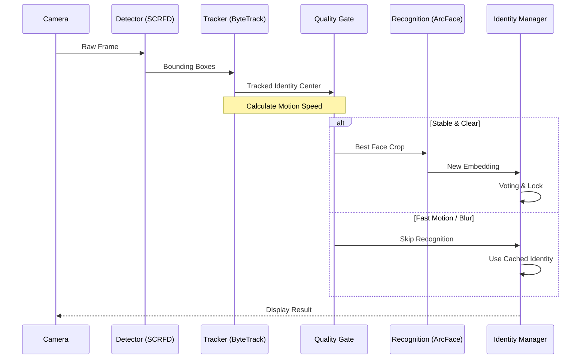

# Crowd Face Identifier Documentation

> [!IMPORTANT]
> **PRIVATE & CONFIDENTIAL**
> This project is the proprietary property of **Alok Kumar**. It is not intended for public distribution or open-source use.

## 1. Project Overview
A professional, high-performance face recognition pipeline built for private security and monitoring. The system features motion-aware processing, temporal best-frame memory, and an event-based recognition trigger to ensure maximum stability and accuracy.

---

## 2. Technology Stack & Core Models

### **Technology Stack**
| Category | Technology / Library |
| :--- | :--- |
| **Language** | Python 3.9+ |
| **Backend** | PyTorch, ONNX Execution Provider |
| **CV Engine** | OpenCV 4.x |
| **Database** | FAISS (Dense Vector Search) |
| **Tracking** | ByteTrack (Kalman Filter + IoU Associator) |
| **Logging** | Loguru (Structured Logging) |
| **Voice** | PyTTsX3 (Multi-threaded TTS) |

### **Core AI Models**
- **Face Detection**:
    - **SCRFD**: (Default) High-efficiency, sub-millisecond detection across various scales.
    - **RetinaFace**: Powerful detector known for extreme precision using deep convolutional networks.
    - **YOLOv5-Face**: Real-time detection optimized for mobile and edge efficiency.
- **Face Tracking**: **ByteTrack**. Robust multi-object tracking that associates detections across frames using motion prediction and IoU.
- **Face Recognition**: **ArcFace (iResNet-100)**. State-of-the-art deep feature extractor (512-d normalized embeddings) optimized for high discriminative power.
- **Matching Algorithm**: **Cosine Similarity**. Measures the angle between feature vectors to determine identity match accuracy.


---

## 3. Setup and Installation

### **Environment Setup**
It is recommended to use a virtual environment (Conda or venv) to manage dependencies.

```shell
# 1. Create Environment
conda create -n face-dev python=3.9
conda activate face-dev

# 2. Install PyTorch (CUDA supported)
pip install torch==1.9.1+cpu torchvision==0.10.1+cpu -f https://download.pytorch.org/whl/torch_stable.html

# 3. Install Requirements
pip install -r requirements.txt
```

---

## 4. Implementation Approach
### **Hardware Requirements**
| Component | Minimum | Recommended |
| :--- | :--- | :--- |
| **CPU** | Intel i5 / AMD Ryzen 5 | Intel i7 / AMD Ryzen 7 |
| **GPU** | NVIDIA GTX 1050 (2GB) | NVIDIA RTX 3060 (6GB+) |
| **RAM** | 8 GB | 16 GB |
| **Storage** | 10 GB (SSD preferred) | 50 GB (for backups/logs) |

---

## 3. Implementation Approach
The system follows a **Motion-Aware, Cache-Driven, Event-Based** approach to solve common production issues like identity flickering and motion blur.

1. **Continuous Tracking**: The system tracks every face in every frame using ByteTrack to maintain identity persistence.
2. **Motion Analysis**: For every track, velocity is computed. Recognition is paused during fast movement to prevent processing blurry frames.
3. **Temporal Quality Gating**: Instead of processing every frame, the system evaluates face quality (blur + pose) and stores the "Best Frame" in a temporal cache.
4. **Event-Based Recognition**: Recognition is triggered only when a track is stable (low motion) and a high-quality "Best Frame" has been captured.
5. **Identity Locking**: Once a person is identified with high confidence across multiple frames (voting), the identity is "locked" to the track to prevent flickering.

---

## 5. Architecture Diagram
The system is built on a modular "Service-Oriented" architecture, allowing each layer (Detection, Tracking, Recognition) to be updated or swapped independently.



---

## 6. Execution Flow
The following flow diagram illustrates the data path for a single video frame.



---

## 7. Folder & File Structure

### **Root Directory**
| File/Folder | Meaning |
| :--- | :--- |
| `main.py` | **Interactive Entry Point**: Orchestrates the entire pipeline. |
| `add_persons.py` | **Enrollment Tool**: Processes raw images into the feature database. |
| `regenerate_features.py` | **Maintenance Tool**: Re-extracts embeddings from existing face crops. |
| `core/` | **Modular Layer**: Contains logic for detection, recognition, and tracking. |
| `modules/` | **Model Implementation**: Heavy-lifting code for SCRFD, ArcFace, and Trackers. |
| `config/` | **System Settings**: YAML configuration for camera, models, and watchlist. |
| `datasets/` | **Data Lake**: Stores face images and the feature database. |

### **Dataset Architecture**
```text
datasets/
├── backup/         # Original images after processing
├── data/           # Cropped face images organized by person
├── face_features/  # FAISS feature database (feature.npz)
└── new_persons/    # Queue for adding new identities
```

### **Core Module Layer (`core/`)**
- `detection.py`: Wrapper for SCRFD. Easily extensible for YOLOv5-Face or RetinaFace.
- `tracking.py`: Wraps ByteTrack. Includes **Motion Speed Calculation**.
- `quality.py`: Logic for **Weighted Quality Fusion** (Blur + Pose).
- `recognition.py`: ArcFace implementation with **Inference Caching**.
- `identity.py`: Manages **Best-Frame Memory** and **Identity Voting**.
- `search.py`: Fast vector similarity using **FAISS**.
- `output.py`: Professional visualization, **Watchlist Monitoring**, and **Voice Alerts**.

---

## 8. Advanced Component Details

### **Motion Gating**
To prevent "Ghosting" or mismatched IDs during fast movement, the system calculates the velocity of every face. If `speed > MOTION_THRESHOLD`, recognition is temporarily paused.

### **Best-Frame Selection**
Instead of recognizing the first frame seen (which might be blurry), the system continuously updates a "Best Frame" in memory for every track. It only triggers recognition when it has collected high-quality evidence.

### **Identity Voting & Locking**
To prevent name flickering, the `IdentityManager` requires multiple matching frames before "Locking" an identity to a track. Once locked, the ID remains stable even if the person turns their head briefly.

---

## 9. Extensibility Guide (Updating Models)
The project is designed for future-proofing:

1.  **To Update Detector**: Modify `core/detection.py` to point to a new model class (e.g., RetinaFace).
2.  **To Update Recognition**: Modify `core/recognition.py`. The interface expects a 512-d vector.
3.  **To Update Tracker**: Modify `core/tracking.py`. The pipeline expects a list of tracked IDs.

---

## 10. Developer & User Workflow

### **1. Identity Enrollment (Adding New Faces)**
The `add_persons.py` script is the gateway for new identities:
- **Scan**: It looks for subfolders in `datasets/new_persons/`.
- **Detect**: It uses SCRFD to find faces in raw images.
- **Crop**: Extracted faces are saved to `datasets/data/<name>/`.
- **Embed**: 512-d features are extracted and merged into `feature.npz`.
- **Archive**: Original raw images are moved to `datasets/backup/`.

### **2. Live Pipeline Execution**
Run `python main.py` for the continuous monitoring system:
- **Gating**: The system avoids recognition during high motion or poor lighting.
- **Fusion**: Identity is determined by the "Best Frame" seen throughout a track's lifetime.
- **Alerts**: Watchlist hits trigger high-priority visual markers and voice notifications.

---

## 11. Performance Tuning Guide
To optimize the pipeline for different environments, adjust the `SETTINGS` dictionary in `main.py`:

| Constant | Default | Purpose |
| :--- | :--- | :--- |
| `MOTION_THRESHOLD` | 500.0 | **Higher** allows recognition on faster moving subjects. **Lower** forces subjects to be still. |
| `QUALITY_THRESHOLD` | 40.0 | **Higher** ensures only HD-quality faces are recognized. **Lower** works better in low light. |
| `RECOGNITION_CONFIDENCE` | 0.25 | **Lower** = Stricter matching (less False Positives). **Higher** = More lenient. |
| `VOTING_WINDOW` | 5 | **Higher** increases stability but adds identification delay. |

---

## 12. Maintenance & Troubleshooting

### **Logging System**
The system uses `loguru` for structured logging. Logs provide critical insights into:
- System initialization and model load times.
- Watchlist detections (Warnings).
- Runtime errors or ingestion failures.

### **Common Issues**
1. **Low FPS**: Ensure `MOTION_THRESHOLD` is not too strictly low, or enable GPU acceleration in `core/recognition.py`.
2. **False Negatives**: Check if faces are too small (Size Check in `QualityGate`). Standard minimum is 30x30 pixels.
3. **Flickering IDs**: Increase the `VOTING_WINDOW` to 10 or 15 for extremely noisy environments.

---

## 13. Technical References
- [ByteTrack Original Repo](https://github.com/ifzhang/ByteTrack)
- [InsightFace - ArcFace Source](https://github.com/deepinsight/insightface/tree/master/recognition/arcface_torch)
- [Yolov5-face Implementation](https://github.com/deepcam-cn/yolov5-face)
- **Tracking Performance**: ByteTrack benchmark (MOTA vs FPS).


---

*Proprietary Software - Alok Kumar - 2026*
